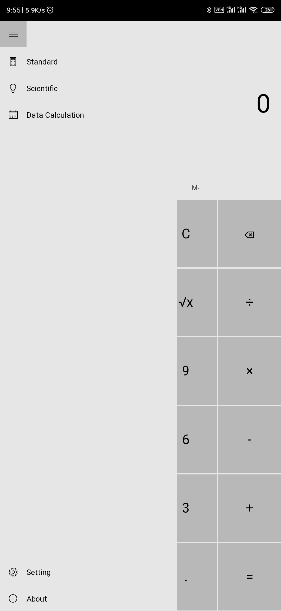

# Caculator 

这是一个网页端计算器, 它模仿了 Windows 10 计算器的界面和功能(部分). 目前已经完成的部分有标准计算器, 科学计算器, 日期计算器.

应用使用 React 框架编写, 使用的组件库是 [React-UWP](https://www.react-uwp.com/). 这是一个模仿 UWP 风格的组件库. 虽然 UI 设计有些简陋, 在 Fluent Design 上的模仿也有很多不足, 不过效果基本还是可以的.


## 运行环境

node v12.16.3
npm 6.14.4
yarn 1.22.4

## 运行

### 安装依赖

```bash
yarn
```

### 调试

```bash
npm run start
```

### 编译静态文件

```bash
npm run build
```

## 界面

界面由侧边栏与主体部分组成. 

 

有四种主题可以调节

 
 

另外还可以调节主题色和背景图片.

[setting](http://47.96.159.162:3001/setting)

## 模块

### 1. Standard Calculator

[link](http://47.96.159.162:3001/standard)

该模块是简单的四则运算, 并不需要对中间过程进行存储, 在每一步计算后, 即可丢弃之前的计算结果. 因此不需要过多的变量来存储组件状态. 该部分介绍略过.

### 2. Scientific Calculator

[link](http://47.96.159.162:3001/scientific)

该部分是科学型计算器. 科学型计算器需要存储中间过程, 因此维护了一个词组栈. 一个简单例子如右所示: `['(', 20, '+', 3, ')', '*', 4]`. 因为算式的处理与界面逻辑无关, 所以这里直接存储一个字符串也是可行的, 但是这样的话在解析时就会麻烦一些, 利用数组实际上相当于提前切分好了词组, 省去了后续词法分析的需求.

对于表达式的求解, 一般的做法是进行语法分析, 将中缀表达式转换为更容易求解的逆波兰表达式.之后维护一个栈, 对逆波兰表达式进行遍历求解. 这是一种常见的做法. 另外还有一种不常见的做法, 就是借助 js 的 eval 函数. 这需要对词组栈进行预处理, 将部分命令修改为相应的函数. 例如算式 `ln(12) + sqrt(8)`, 其对应的栈为 `["ln", "(", 12, ")", "+", "sqrt", "(", 8, ")"]`, 进行简单的预处理可以得到 `["Math.log", "(", 12, ")", "+", "Math.sqrt", "(", 8, ")"]`, 之后直接拼接字符串, 得到 js 语句 `"Math.log(12)+Math.sqrt(8)"`, 运行即可得到结果.

因此需要维护一个词典来进行预处理工作.

对于 UI 而言, Win 10 的计算器与一般的科学计算器并无相同. 由于是边输入边产生结果, 因此需要更多的容错空间. 这里有几个变量比较关键. 一个是状态值 `status`, 取值 0, 1, 2. 分别对应自由输入, 按下二元操作符, 按下等号三种状态. 这三种状态的具体表现在这里不再赘述, 打开计算器试一试可以很容易得到结果. 状态的不同, 按键反映到 UI 上的操作也不尽相同. 这是三个大状态, 除此之外还有各种各样的小状态, 需要编写繁缛的判断去决定 UI 如何更新.

举个简单的例子, 第一行为'3 + ', 第二行为5, 此时按下'+', '+'号上去第一行的同时, 也把第二行的数字带了上去. 而第一行变为'5 +'. 而当第一行是'( 5 + 3 )'时, 此时按下'+', 就不能再把第二行的数字带上去, 否则就产生了 '( 5 + 3 ) 5 + ' 的算式. 另外还要对一些错误进行容错, 以及不同情况下的退格处理, 以及运算栈何时保留与清楚, 都需要综合各种情况决定.

除此之外还有括号问题, 正负转换问题等等...

### 3. Date Calculator

[link](http://47.96.159.162:3001/date)

这部分有两个功能, 一个是计算两日期的间隔, 零一个是计算某日期前推后溯一段时间后的日期. 这部分没有任何技术含量, 主要工作还是在写 UI. 目的是还想看 web 端能模仿 UWP 到什么程度.

### 4. 设置与关于

设置提供了一个简单的页面来更改界面主题, 强调色, 背景图片. 组件库提供的 api 有一些 bug, 另外也想持久化主题的设置选项, 因此使用了前端存储. 不过这样的话, 主题跟随系统的功能就不得不砍掉了.


关于页面就是一个很普通的页面, 没有什么好说的.


